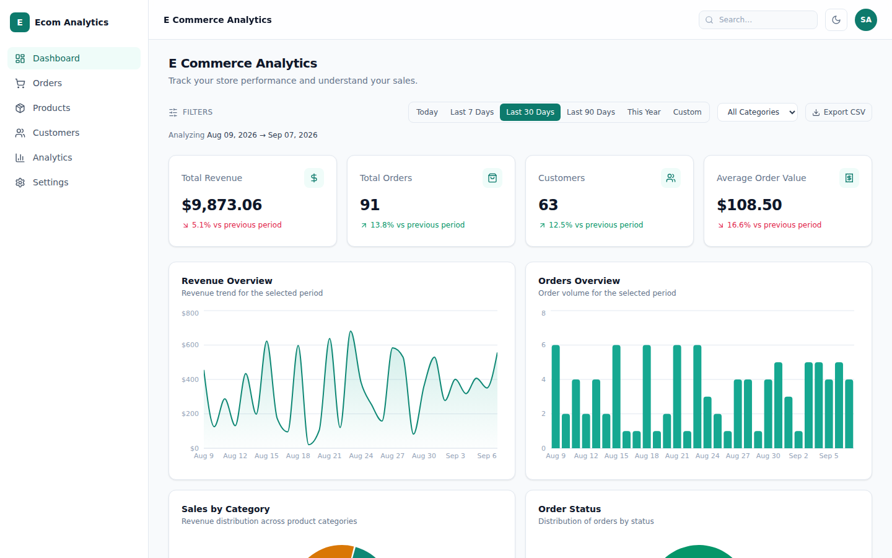
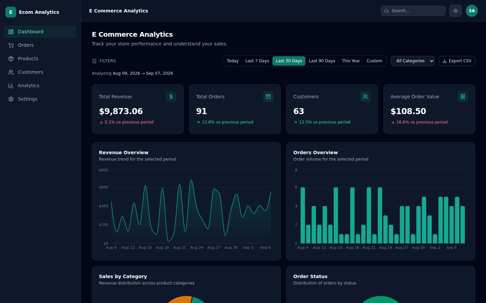
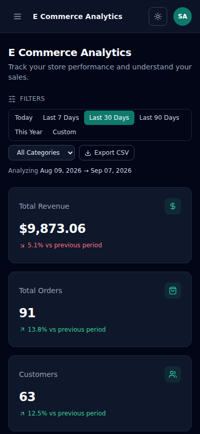

# E-Commerce Analytics Dashboard

A full-stack analytics dashboard for an e-commerce store: real MongoDB
aggregation pipelines power interactive revenue, order, category, and
status charts, with server-side filtering, search, pagination, and CSV
export — all built and tested across eight incremental parts.



<details>
<summary>Dark mode & mobile</summary>




</details>

> Screenshots are from local testing against a realistic fixture dataset
> (see [Live Demo](#live-demo) below for why — no data here is fabricated
> or hand-tuned to look better than the real seeded database).

## Live Demo

**Not deployed.** This project was built in a sandboxed environment with
no network access to hosting providers (Render, Railway, Vercel, Netlify)
or MongoDB Atlas, and no accounts/credentials for any of them — so there
is no live URL to link here. The application is fully deployment-ready
(see [Deployment](#deployment) below for exactly what's configured and
the steps to actually deploy it).

## Features

- **Real MongoDB aggregation** — revenue, orders, category, and
  order-status analytics are computed server-side with `$match`/
  `$group`/`$unwind`/`$facet` pipelines against real order/item data, not
  precomputed or hardcoded.
- **Interactive charts** — revenue area chart, orders bar chart, and two
  donut charts (category revenue, order status) built with Recharts,
  fully responsive and dark-mode aware.
- **Server-side filtering** — date range (6 presets + custom), category,
  and order status, all consistently applied across stat cards, charts,
  tables, and CSV export from one shared filter state (also mirrored into
  the URL).
- **Real trend percentages** — stat cards compare the selected period
  against the immediately preceding period of equal length, computed from
  two live API calls. Never a fabricated `+12.4%`.
- **Orders & Products pages** — debounced search, server-side pagination,
  and status filtering, without loading full collections into the browser.
- **CSV export** — respects whatever filters are currently active.
- **Light & dark mode**, fully responsive (tested 375px–1920px).
- **Automated tests** — 66 backend (Vitest + Supertest), 103 frontend
  (Vitest + React Testing Library), 2 Playwright E2E tests.
- **Production hardening** — Helmet, rate limiting, environment-aware CORS
  (fails closed rather than defaulting to `*`), a DB-aware health check,
  and no stack traces leaked in error responses.

## Tech Stack

| Layer | Technology |
|---|---|
| Frontend | React 18, Vite, Tailwind CSS, Recharts, React Router, Axios |
| Backend | Node.js, Express, Mongoose |
| Database | MongoDB |
| Testing | Vitest, React Testing Library, Supertest, Playwright |
| Security | Helmet, express-rate-limit, environment-aware CORS |

## Architecture

```
React (Vite) frontend  ──HTTP/JSON──>  Express REST API  ──Mongoose──>  MongoDB
   client/src/api/*                     server/routes → controllers
   (Axios, VITE_API_URL)                → services → aggregation
                                           pipelines
```

- **Frontend** (`client/`) — a single-page app (React Router) that never
  talks to MongoDB directly; every number on screen comes from
  `client/src/api/*.js`, which reads `VITE_API_URL`.
- **Backend** (`server/`) — `app.js` builds the Express app (routes,
  middleware, no DB connection — this is what tests import directly);
  `server.js` is the actual entry point that connects to MongoDB and
  starts listening. Routes → controllers → services, with MongoDB
  aggregation living in `services/analyticsService.js`.
- **Database** — Mongoose models for `Product`, `Customer`, and `Order`
  (with embedded line items and shipping address), plus a seed script
  that generates ~48 products, ~100 customers, and 300–500 realistic
  orders spread across 6–12 months.

## Local Setup

Requires Node.js 18+ and a MongoDB instance (local or Atlas).

```bash
# 1. Backend
cd server
cp .env.example .env      # set a real MONGO_URI
npm install
npm run seed               # populate the database with realistic sample data
npm start                  # http://localhost:5000

# 2. Frontend (in a new terminal)
cd client
cp .env.example .env      # VITE_API_URL=http://localhost:5000/api
npm install
npm run dev                 # http://localhost:5173
```

### Tests

```bash
# Backend
cd server && npm run test:run        # or npm run test:coverage

# Frontend
cd client && npm run test:run        # or npm run test:coverage

# End-to-end (needs the app built + served, and a running backend — see client/README.md)
cd client && npm run test:e2e
```

See `server/README.md` and `client/README.md` for the full test
breakdown (what each file covers) and the specific database-isolation
approach used for backend tests (no live/in-memory MongoDB was available
in the sandbox this was built in — see that README for details and the
one real limitation that follows from it).

## Environment Variables

**`server/.env`** (see `server/.env.example`):

| Variable | Purpose |
|---|---|
| `MONGO_URI` | MongoDB connection string. Never hardcoded, never committed. |
| `PORT` | Port the Express server listens on (default 5000). |
| `NODE_ENV` | `development` or `production` — controls CORS strictness and whether error responses include detail. |
| `CLIENT_URL` | The deployed frontend's origin, for CORS. **Required** in production — if unset, cross-origin requests are rejected rather than falling back to allow-all. |

**`client/.env`** (see `client/.env.example`):

| Variable | Purpose |
|---|---|
| `VITE_API_URL` | Base URL of the backend API, e.g. `http://localhost:5000/api` in development or `https://your-backend-domain.com/api` in production. Every frontend API call reads this — nothing is hardcoded to `localhost`. |

No secrets (database credentials, API keys) are ever read by or exposed
to the frontend — `MONGO_URI` exists only in the backend's environment.

## Deployment

Not deployed (see [Live Demo](#live-demo)), but everything needed to
deploy it is already configured and verified locally:

**Backend** — deployable to Render, Railway, Fly.io, or similar:
- Build command: `npm install`
- Start command: `npm start`
- Environment variables: `MONGO_URI`, `PORT` (usually provided by the
  platform), `NODE_ENV=production`, `CLIENT_URL=<your deployed frontend>`
- The app fails closed on CORS if `CLIENT_URL` is missing in production
  (logs a warning rather than silently allowing every origin)
- `GET /api/health` returns `{ success: true, status: "ok", database:
  "connected" | "disconnected" }` for uptime monitoring

**Frontend** — deployable to Vercel, Netlify, or Cloudflare Pages:
- Build command: `npm run build`
- Output directory: `dist`
- Environment variable: `VITE_API_URL=<your deployed backend>/api`
- Route-level code splitting is already in place (`React.lazy`), so the
  initial JS payload doesn't include the charting library until you
  actually visit the dashboard

**Database** — MongoDB Atlas (or any hosted MongoDB): create a
production database separate from any local development one, add a
database user with a strong password, configure network access for your
backend host, then run `npm run seed` **once** against it — the seed
script is not run automatically on server start.

## Performance & Accessibility

A local Lighthouse audit (see `client/README.md` for how to reproduce)
found and led to fixing:

1. **Bundle size** — route-level code splitting cut the initial JS
   payload from 688 KB to 182 KB by moving Recharts into a
   Dashboard-only lazy chunk.
2. **Color contrast** — two color/text combinations failed WCAG AA
   (2.56:1 and 4.38:1 against the 4.5:1 minimum); fixing them raised the
   Lighthouse Accessibility score from 95 to **100**.
3. **Render-blocking fonts** — switched the Google Fonts stylesheet to a
   non-blocking preload-then-swap pattern, improving Largest Contentful
   Paint from ~3.7s to ~3.1s in the same audit environment.

One remaining, documented (not "fixed blindly") finding: Recharts itself
ships a meaningful amount of code that isn't fully tree-shakeable
(~89 KB flagged as unused in its own chunk) — a known limitation of that
library, not something addressed here since swapping charting libraries
was explicitly out of scope for this project.

## API

All responses follow `{ success: boolean, data, message? }`; paginated
endpoints also include a `pagination` object.

| Endpoint | Description |
|---|---|
| `GET /api/analytics/summary` | Total revenue, orders, customers, average order value |
| `GET /api/analytics/revenue` | Revenue grouped by date |
| `GET /api/analytics/orders` | Order count grouped by date |
| `GET /api/analytics/categories` | Revenue grouped by category |
| `GET /api/analytics/order-status` | Order count per status (all 5 statuses always present) |
| `GET /api/analytics/top-products` | Best-selling products, sortable, `?limit=` (max 50) |
| `GET /api/orders` | Paginated order list — `page`, `limit`, `search`, `status`, `category`, `startDate`, `endDate` |
| `GET /api/orders/recent` | Latest orders |
| `GET /api/products` | Paginated product list — `search`, `category` |
| `GET /api/customers` | Paginated customer list — `search` |
| `GET /api/categories` | Category names, read live from the database (never hardcoded) |
| `GET /api/health` | Health check, includes DB connection status |

All analytics endpoints accept `startDate`/`endDate` (paired,
`YYYY-MM-DD`) and `category` (omit or `All` for no filter); revenue
figures count `Completed`/`Processing`/`Pending` orders unless an
explicit `status` is requested.

## Project Structure

```
server/     Express API, Mongoose models, seed script, tests   → server/README.md
client/     React dashboard, tests, E2E                        → client/README.md
docs/       Screenshots
```

See the two package-level READMEs for full directory breakdowns.
